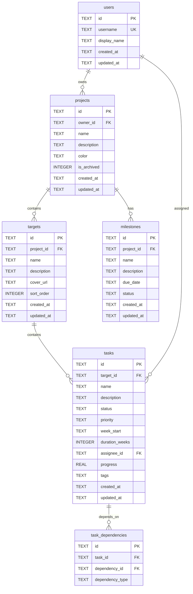

# Database Design

## ER Diagram

## Table Details

### users
Multi-user support. API keys are managed in-memory (not stored in DB).

### projects
Soft-delete via `is_archived` flag. Default color is cyber blue `#3b82f6`.

### targets
Scoped to a project. `sort_order` controls display order in goal grid.

### tasks
- **status**: `todo`, `in_progress`, `review`, `done`, `cancelled`
- **priority**: `low`, `medium`, `high`, `urgent`
- **week_start**: ISO date (Monday of the task's week)
- **progress**: 0-100 (real number)
- **tags**: JSON array string (e.g. `["frontend","urgent"]`)

### task_dependencies
- **dependency_type**: `finish_to_start`, `start_to_start`, `finish_to_finish`, `start_to_finish`
- UNIQUE constraint on `(task_id, dependency_id)`

### milestones
- **status**: `pending`, `completed`, `cancelled`
- `due_date` stored as ISO date string

## Views

### target_stats
Computed view joining targets with tasks:
- `total_tasks`, `done_tasks`, `completion_rate`, `overdue_tasks`
- Overdue = tasks where `week_start < today` AND `status != 'done'`

### week_summary
Aggregated by `(week_start, target_id)`:
- `task_count`, `done_count`, `in_progress_count`

## Migrations

Migrations live in `packages/server/src/db/migrations/`:
- Files named `NNN_description.sql` (e.g. `001_initial.sql`)
- Schema version tracked via SQLite `user_version` PRAGMA
- Applied automatically on server startup

To add a new migration:
1. Create `packages/server/src/db/migrations/002_your_change.sql`
2. Restart server — migration applies automatically

## Backups

Daily backup at 02:00 via `node-cron`:
- Snapshot to `backups/YYYY-MM-DD.db`
- Retains last 7 backups, auto-cleans older files
